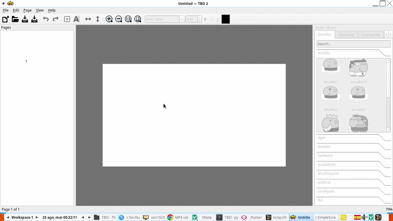

# TBO 2

This is the Python and PyQt6 reimplementation of TBO. The original C/GTK code is
retained as a compatibility reference under [`legacy/`](legacy/).

English is the source language for the application, with translations available
for other languages (see [Translations](#translations)).

## Running from the repository

Use the launcher from the repository root:

```bash
./tbo.sh
```




### With help

```
./tbo.sh data/tut.tbo
```

The launcher configures `PYTHONPATH` automatically and can be invoked from any
directory.

The equivalent command without the launcher is:

```bash
PYTHONPATH=src python3 -m tbo data/tut.tbo
```

### Forcing a language

The application follows the system language by default. To force a specific
language (for example, to run it in English for tutorials or screenshots), pass
`--lang <locale>`:


#### Run on english

If you are in your Linux on spanish language and you want open on english put:

```bash
./tbo.sh --lang en
```

in spanish with the tutorial:

```bash
./tbo.sh --lang es data/tut.tbo
```

`--language` is an alias for `--lang`. Without it, the saved preference (if any)
or the system language is used.

Omit the document path to create a new comic. The application can read and
render pages, panels, text, images, and SVG resources from the historical
format.

## Keyboard shortcuts

- `Ctrl+N`: create a comic with a title and dimensions;
- `Ctrl+O`: open a document;
- `Ctrl+S`: save atomically;
- `Ctrl+Shift+S`: save a copy;
- `Ctrl+E`: export;
- `PageUp` / `PageDown`: previous or next page;
- `Ctrl+Shift+N`: add a page after the current page;
- `Ctrl+Delete`: delete the current page;
- `Ctrl+PageUp` / `Ctrl+PageDown`: move the current page left or right;
- `Ctrl+wheel`, `+` / `-`: zoom in / out (centered on cursor);
- `1`: return to actual size;
- `2`: fit the page to the window;
- `F`: add a panel;
- `T`: add text while editing a panel;
- drag a selected panel: move it;
- drag its yellow bottom-right handle: resize it;
- arrow keys: move the selection in 5-pixel increments;
- `Ctrl+D`: clone the selected panel or object;
- `Ctrl+C` / `Ctrl+V`: copy / paste panels or objects;
- `Ctrl` + click / drag: multi-select;
- `Ctrl+A`: select all panels (page mode) or all objects (panel editing);
- `Space` + drag: pan the view without moving the selection;
- `Delete`: delete the selected panel or objects;
- `Ctrl+Z` / `Ctrl+Shift+Z`: undo or redo;
- `Esc`: leave panel editing mode;
- `[` / `]`: rotate selected object left / right;
- `H` / `V`: flip selected object horizontally / vertically;
- `F5`: full-screen presentation mode;
- `Ctrl+F`: find text in the document.

## Preferences, theme and session

- **Theme** (View ▸ Theme): System / Dark / Light, remembered between runs.
- **Snap to Grid** (View ▸ Snap to Grid): aligns panels to a 10 px grid while
  moving or resizing them, and shows the grid on the canvas.
- The application **reopens the last document** it had open when it exits, so
  you can pick up where you left off.

## Pages and search

- The **Pages** dock on the left shows a thumbnail of every page; click one to
  jump to it. Thumbnails refresh as the comic is edited.
- **Edit ▸ Find Text…** (`Ctrl+F`) searches every text object in the document
  and navigates to the page and panel containing a match.
- The **Character** tab of the asset library contains a buildable character
  made of separate SVG parts: a blank head plus `eyes`, `mouth` and `ears`
  categories with several expressions. Drop each part onto a panel and arrange
  them freely. The generator script is `tools/generate_character_parts.py`.

### Custom assets

The library also scans user data directories, so you can add your own SVG
drawings without converting anything. Place your files under `~/.tbo/doodle/`
or `~/.local/share/tbo/doodle/`, organized by folder (e.g.
`head/eyes/my_eyes.svg`), and they are merged into the matching categories.

See **[docs/creating-characters.md](docs/creating-characters.md)** for the full
guide: where to put files, the folder layout, size/viewBox policies, and how to
build a character from scratch when the bundled ones are not what you want.

Adding, cloning, moving, resizing, and deleting panels changes the document
model and is recorded in the undo history. Creating, deleting, and reordering
pages is reversible as well. An asterisk in the window title indicates unsaved
changes.

Double-click a panel to edit its contents. In this mode, you can select and drag
text, images, or SVGs, clone them with `Ctrl+D`, move them with the arrow keys,
and delete them with `Delete`. These operations support undo/redo and persist in
the `.tbo` file. The Edit menu also lets you add formatted text or import raster
images and SVG files. Press `Esc` to return to page editing; other panels are
dimmed while a panel is being edited.

While editing a panel, the **Asset Library** dock on the right offers the SVG
doodles and speech bubbles shipped with the application. The **Doodles** and
**Bubbles** tabs group assets by category with a search box; clicking a preview
inserts the asset into the current panel as an `SvgObject` that is undoable and
persists in the `.tbo` file. The dock is disabled outside panel editing mode.

TBO 2 currently writes the unversioned v1 format for compatibility with the
historical application. Use **Save As** while the new implementation remains in
development.

When there are pending changes, TBO asks whether to save, discard, or cancel
before creating another document, opening one, or closing the window. Canceling
never replaces the document or removes its undo/redo history.

## Session recovery and preferences

- **Recovery**: saving a file keeps a `.bak` copy of the previous version. A
  background timer also writes an `.autosave` copy of a modified document every
  30 seconds; the copy is removed as soon as the file is saved. The original
  document is never overwritten without an explicit save.
- **Preferences** are persisted with `QSettings` and kept separate from `.tbo`
  documents: window geometry, the last directory used, and the list of recent
  files (**File ▸ Recent Files**). No sensitive paths are written to logs.
- **HiDPI**: the application enables high-DPI scaling and loads Qt translations
  for the configured locale. Interface strings are already marked for Qt
  Linguist; translation catalogs will be added once the terminology stabilizes.

## Exporting

Use **File ▸ Export…** (`Ctrl+E`) to render the document to image files. The same
renderer draws the on-screen canvas and the exported files, so the output matches
the editor. The export dialog lets you choose the format, whether to export all
pages or only the current page, and the output scale (up to 1000 %) for PNG.

- **PNG**: one file per page, named `name-1.png`, `name-2.png`, ….
- **PDF**: a single multi-page document.
- **SVG**: one vector file per page.

Missing raster or SVG resources are drawn as a dashed red rectangle rather than
aborting the export.

## Presentation mode

Press **`F5`** (View ▸ Presentation) to read the comic in full screen. Navigate
with the arrow keys, `Space`, or `PageUp`/`PageDown`; press `Esc` to leave.

## Translations

English is the source language of the interface (including the Help dialog).
Strings are marked with `tr()` and extracted with Qt Linguist:

```bash
./packaging/update_translations.sh
```

The script runs `pylupdate6` (or `lupdate`) to produce `translations/tbo_<locale>.ts`
and `lrelease` to compile the `.qm` catalogs. The application loads
`tbo_<locale>.qm` for the configured locale (see `application.py`); without a
saved preference it follows the system language.

Available translations: **English** (`tbo_en`) and **Spanish** (`tbo_es`).

To run the application in a specific language, use the `--lang <locale>`
command-line option (e.g. `./tbo.sh --lang en`); see
[Forcing a language](#forcing-a-language).

To add or update a language:

```bash
pylupdate6 src/tbo -ts translations/tbo_es.ts
# edit translations/tbo_es.ts with Linguist, then:
lrelease translations/tbo_es.ts -qm translations/tbo_es.qm
```

## Tests

The unit tests run without a display. The integration tests drive a real
`QGraphicsView`, so they need a working Qt platform plugin. A virtual display
such as `xvfb-run` is the most reliable option:

```bash
xvfb-run -a python3 -m pytest
```

`QT_QPA_PLATFORM=offscreen` also works, but it can abort when the graphics view
is torn down, depending on the Qt build. The unit tests (`tests/unit`) never
touch the view and always run headless.

### Platform support

Tested with:

| Plugin    | Environment            | Status          |
|-----------|------------------------|-----------------|
| xcb       | X11 (`DISPLAY=:0`)     | Working         |
| wayland   | Wayland compositor     | Plugin available |
| offscreen | Headless (CI/tests)    | Working         |

Run `./test_platforms.sh` in the source checkout to verify the available
backends start and exit cleanly.

Editable development installation:

```bash
python3 -m pip install -e '.[dev]'
```

## Continuous integration

GitHub Actions workflows live in `.github/workflows/`:

- **`ci.yml`** runs automatically on every push/PR: lint (`ruff`), unit tests,
  and a coverage report (threshold 80 % on the critical modules) for Python 3.11
  and 3.12.
  The Qt integration tests are **not** run in CI: tearing down a `QGraphicsView`
  aborts in headless runners (see below). They must be run locally with a
  display or `xvfb-run`.

The full collection of fixes and commands that took this CI to green is in
**[docs/GitHub-Actions-Solutions/CI-CD-GitHub-Actions-For-PyQt6.md](docs/GitHub-Actions-Solutions/CI-CD-GitHub-Actions-For-PyQt6.md)**.
For agents starting a **new** PyQt6 project, see
**[docs/GitHub-Actions-Solutions/CREATING-PYQT6-PROJECT.md](docs/GitHub-Actions-Solutions/CREATING-PYQT6-PROJECT.md)**.
- **`build.yml`** is **manual** (`workflow_dispatch`, triggered from the Actions
  tab) and produces the distributable executables as artifacts: Python
  wheel/sdist, a Debian `.deb`, a Flatpak bundle, a **Windows standalone
  `.exe`** compiled with [Nuitka](https://nuitka.net/), and a **macOS `.app`**
  built with PyInstaller.
- The Windows/macOS configurations mirror
  [lucio-iva-calculator](https://github.com/wachin/lucio-iva-calculator) (see
  its `windows-exe-fixes.md`): no UPX, embedded product/version metadata,
  application icons, and no console window — the combination that produced
  clean VirusTotal results.

Coverage locally:

```bash
python3 -m pytest tests/unit --cov=src/tbo --cov-report=term-missing
```

## Third-party code

The **inline text editor** (double-click a text object to edit it on the
canvas) is based on the `InlineTextEditor` from **ksnip**:

- Source file: `third-party/ksnip/ksnip_py/canvas.py` (git submodule)
- Repository: https://github.com/wachin/ksnip
- Direct link: https://github.com/wachin/ksnip/blob/master/ksnip_py/canvas.py

ksnip is included as a **git submodule** under `third-party/ksnip`. To clone it
after a fresh checkout:

```bash
git submodule update --init third-party/ksnip
```

## Resources and packaging

The application resolves its asset library through `tbo.resources`. In a source
checkout it uses `data/doodle` from the repository root. When installed as a
package, it also looks in `share/tbo/doodle` under the installation prefix; the
Flatpak/deb build is expected to install the doodle tree there.

- Versioning, changelog, and support policy are defined in `CHANGELOG.md`.
- `pyproject.toml` declares the package, its `tbo` entry point, dev
  dependencies, and `package-data` for future `translations/*.qm` catalogs.

### Packaging helpers (`packaging/`)

- `tbo.desktop` and `org.tbo.TBO.appdata.xml`: freedesktop metadata.
- `org.tbo.TBO.json`: Flatpak manifest (installs the app, desktop entry,
  AppStream data, icon, and the doodle tree under `share/tbo/doodle`).
- `org.tbo.TBO.svg`: application icon.
- `build.sh`: builds the sdist/wheel, runs lint and unit tests, generates
  checksums and a dependency list, and verifies a clean install.
- `update_translations.sh`: extracts strings to `translations/*.ts` with
  `pylupdate6`/`lupdate` and compiles `.qm` files with `lrelease`.

### Building the Debian package

The `debian/` directory in the source root produces a binary `.deb`:

```bash
dpkg-buildpackage -b -uc -us
```

**Required system packages** (install them with `apt`):

```bash
sudo apt install build-essential debhelper dh-python python3 python3-setuptools \
    pybuild-plugin-pyproject python3-build python3-installer \
    python3-pil python3-pyqt6 python3-pyqt6.qtsvg python3-pyqt6.qtpdf \
    lintian debsums
```

- `pybuild-plugin-pyproject`, `python3-build` and `python3-installer` are needed
  by the pybuild **pyproject** backend (the modern PEP 517 way; do not use a
  legacy `setup.py`).
- `python3-pil` is used to resize the menu icon to 48×48 during the build.
- `python3-pyqt6.qtpdf` is only a recommendation (needed for PDF export).
- `lintian` and `debsums` are audit tools (see the audit steps below).

After building, **audit the package before installing** it with gdebi:

```bash
lintian tbo_2.0.0.dev0-1_all.deb                 # Lintian checks
dpkg-deb --info tbo_2.0.0.dev0-1_all.deb          # metadata/dependencies
dpkg-deb --contents tbo_2.0.0.dev0-1_all.deb      # what will be installed
apt install --dry-run ./tbo_2.0.0.dev0-1_all.deb  # verify deps without installing
```

Optional but recommended for translations:

```bash
sudo apt install qt6-base-dev-tools   # provides lrelease / lupdate
```

The generated package installs the application, the doodle library under
`/usr/share/tbo/doodle`, the desktop entry, AppStream metadata, and the
application icon.

**Lintian warnings**: `dpkg-buildpackage` ends with Lintian and it exits `0`
even when it prints warnings. The two most common are harmless for this project:

- `initial-upload-closes-no-bugs` — the changelog does not reference a bug
  number. It is a lint warning, not an error.
- `no-manual-page` — `/usr/bin/tbo` is a GUI application without a man page.
  To silence it, a minimal man page can be added under `debian/tbo.manpages`;
  it is optional and does not affect the install.

```bash
./packaging/build.sh
./packaging/update_translations.sh
cd packaging && flatpak-builder build org.tbo.TBO.json --force-clean
```

The `.tbo` format is treated as untrusted input. Do not relax its validation or
limits without adding a regression test first.
